# Car Marketplace Assistant on Amazon Bedrock AgentCore

A hands-on guide that takes a LangGraph agent from a container to a managed runtime, connects it to live data in MongoDB Atlas through a reviewable tool, and shows what the agent did and what it cost. It is organized in three parts, each with its own numbered steps:

1. **Part 1, deploying agents:** a LangGraph agent running on AgentCore Runtime, and the same assistant as a Harness. Both answer a simple hello.
2. **Part 2, connecting the agent to MongoDB Atlas:** the capabilities built in the console, from the IAM role to the Gateway tool, ending with the runtime switched to the image that uses them.
3. **Part 3, reviewing the console:** what each agent did, how long it took, and what it cost.

This repository holds everything the guide uses: the agent image (`agent/`), the Lambda tool with its zip already built (`lambda/dist/search_cars.zip`), the sample data, and the GitHub Actions pipeline that pushes the image to Amazon ECR.

The scenario is an online used car marketplace that runs one AI sales assistant per dealership. The agent is written in LangGraph and runs as a container today. This guide moves it to AgentCore without a rewrite, then adds a single data tool backed by MongoDB Atlas. The same image runs with or without that tool: if `GATEWAY_URL` is set it uses the tool, otherwise it answers without it.

### Prerequisites

1. **Image in ECR.** The pipeline (or `./scripts/build_and_push.sh`) has pushed the agent image to `agentcore/dealership-assistant-agent`, tagged `:latest`.
2. **Data in Atlas.** `python data/seed_mongodb.py` has loaded `car_marketplace.stores` and `car_marketplace.cars`.
3. **CloudWatch Transaction Search** is enabled once for the account and Region, so the traces in Part 3 are collected.
4. **Runtime platform V1.** This guide uses V1, where a runtime is ready in seconds after a create or an update. See the note on V1 versus V2 in Part 1, Step 4.

---

# Part 1: Deploying Agents

**Goal:** move a LangGraph agent to a managed runtime without a rewrite, and show the no-container alternative (the Harness) for simpler agents.

## Step 1: The repository

This is the repository you are reading, with a pipeline that builds the agent image and pushes it to Amazon ECR. From the project root, look at what is inside:

```bash
ls agent
```

Three things are worth noting:

1. `agent/agent.py`: a plain LangGraph agent on an Amazon Bedrock model. This is the kind of agent many teams already run. It loads tools from an AgentCore Gateway when `GATEWAY_URL` is set, and answers without tools otherwise.
2. `agent/Dockerfile`: a standard container, built for ARM.
3. `.github/workflows/deploy-agents.yml`: on every change to `main`, GitHub Actions builds the image and pushes it to ECR. The CI/CD stays the same; only the destination changes.

## Step 2: The pipeline run

In the repository, open **Actions > Deploy agent to ECR** and review the last successful run: one job building for `linux/arm64` and pushing the image to ECR, tagged `latest`.

## Step 3: The image in Amazon ECR

Open **Amazon ECR > Private repositories**. There is one repository, `agentcore/dealership-assistant-agent`, with the image tagged `latest`. The same image runs with or without the inventory tool, decided at runtime by the `GATEWAY_URL` environment variable.

Open `agentcore/dealership-assistant-agent` and note the `latest` tag.

## Step 4: Create the runtime

Open **Amazon Bedrock AgentCore > Runtime > Create runtime** and fill the form from top to bottom:

**Runtime details**

1. **Name:** `dealership_assistant` (letters, numbers, and underscores; up to 48 characters).
2. **Runtime platform versions:** **V1** (*"Your container image is downloaded and installed at session start"*). See the note below on V1 versus V2.
3. **Compute type:** **microVMs** (pay per use, each session in its own isolated microVM). The compute type cannot be changed after the runtime is created.

**Agent source**

4. **Source type:** **ECR Container**.
5. **Image URI:** click **Browse images** to open the **Select container image** dialog. Choose the repository `agentcore/dealership-assistant-agent`, select the row with the `latest` tag, and click **Select**. The **Image URI** field resolves to `...agentcore/dealership-assistant-agent:latest` (see figure below). No need to type or paste the URI.

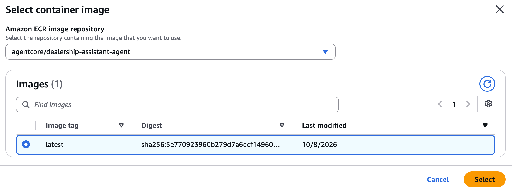

**Permissions**

6. **IAM permissions:** **Create default role**. The console fills in a name like `AmazonBedrockAgentCoreRuntimeDefaultServiceRole-xxxxx`; keep it. Part 2 adds one permission to this role.

**Inbound Auth**

7. **Protocol:** **HTTP**.
8. **Inbound Auth Type:** **Use IAM permissions**. Only AWS identities allowed to invoke the runtime can call it, such as your console user for the **Test** button. No end user login in this example.

**Filesystem configuration (optional)**

9. Leave it empty. The agent keeps no files between sessions.

**Advanced configurations**

10. **Security:** **Public**.
11. **Environment variables:** optional. The agent ships with a default model (`us.amazon.nova-2-lite-v1:0`), so it starts with no variables set. To run a different model, click **Add new variable** and add `BEDROCK_MODEL_ID` = the model id you want; the agent reads it at startup and overrides the default.
12. **Lifecycle configurations:** keep the defaults, **Session idle timeout** 15 minutes and **Runtime lifecycle** 8 hours.

13. Click **Create runtime**. The console also creates a `DEFAULT` endpoint pointing to the latest version, which is what the **Test** button uses.

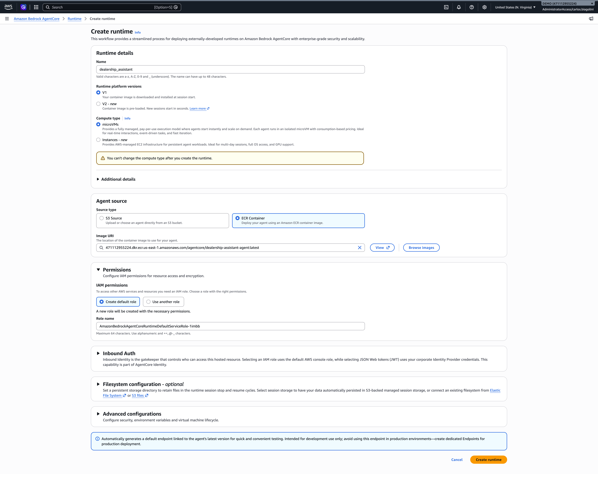

#### Why V1 here, and when V2 is worth it (platform version)

The console offers two platform versions. They differ in how the agent starts ([Platform versions](https://docs.aws.amazon.com/bedrock-agentcore/latest/devguide/runtime-how-it-works.html), [Optimize your agent for Runtime V2](https://docs.aws.amazon.com/bedrock-agentcore/latest/devguide/runtime-v2-optimize.html)):

| | V1 (default) | V2 |
|---|---|---|
| How a session starts | Downloads and initializes the container on each cold start | Restores a **snapshot** of the already initialized environment |
| Cold start | Varies with image size and concurrency | Fast and consistent, regardless of image size or concurrency |
| Create or update | Ready in seconds | Several minutes, while the snapshot is prepared (once per version) |
| Cost | Standard | Billed on what the agent actively uses; memory is reclaimed as the agent releases it. AWS highlights lower cost for always on or bursty agents |
| Health check | Standard | The container must answer `/ping` as healthy within 120 seconds, or creation fails |
| Environment variables | Up to 4 KB | Up to 2.5 KB for containers, for now |
| Regions | All AgentCore Regions | us-east-1, us-east-2, us-west-2, eu-west-1, ap-northeast-1 |
| CloudFormation and CDK | Supported | Cannot set the platform version yet |

**This guide uses V1** so that creating a runtime or switching its image finishes in seconds. The trade off is a slower, less predictable cold start on the first request of a new session, so it helps to send a hello to each runtime right after creating or updating it.

**In production, V2 is usually the better choice** for a buyer facing assistant: every new session starts fast, whatever the image size or traffic peak, and the cost follows actual use. What V2 means for the code: everything done at startup is frozen in the snapshot and shared by every instance. Build reusable things at startup (imports, static configuration, clients); compute anything that changes or expires in the request handler (time, random values, identifiers, credentials). AWS's own example of what not to cache at startup is the tool list from AgentCore Gateway. Both agents in the repository already follow this, so they can move to V2 with no code change.

Once the runtime shows **Ready**, send a first hello to warm it up before using it.

## Step 5: Create the Harness

Open **Amazon Bedrock AgentCore > Harness**, expand **Create Harness**, and choose **Advanced create Harness**:

1. **Harness name:** `dealership_assistant_harness`.
2. **API source:** Bedrock. **Model:** the same Nova model as the runtime.
3. **System prompt:** the same instructions as the simple agent:

```
You are the AI sales assistant of a dealership listed on an online used car marketplace. You help buyers think about which vehicle fits their needs and budget, and you explain financing in plain words. You do not have access to the inventory, prices, or the buyer's history: if asked, say so and offer to have a salesperson follow up. Never invent prices or availability. Be concise and friendly.
```

4. **Permissions:** default (new execution role). Click **Create Harness**.

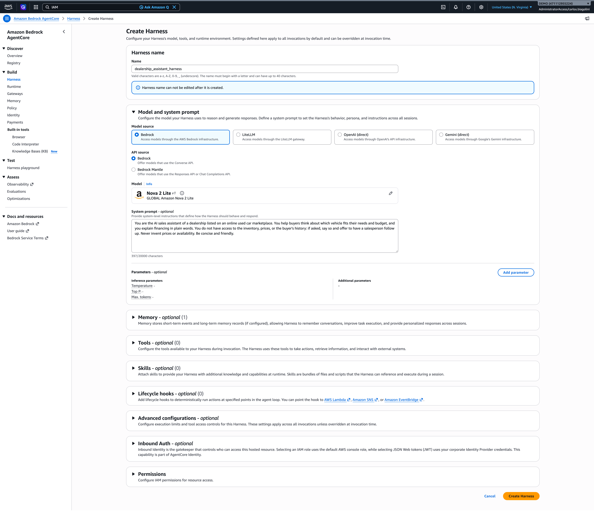

The Harness is usually ready quickly.

## Step 6: Say hello to both

**Runtime:** open `dealership_assistant`, click **Test**, and send:

```json
{"prompt": "Hello, who are you?"}
```


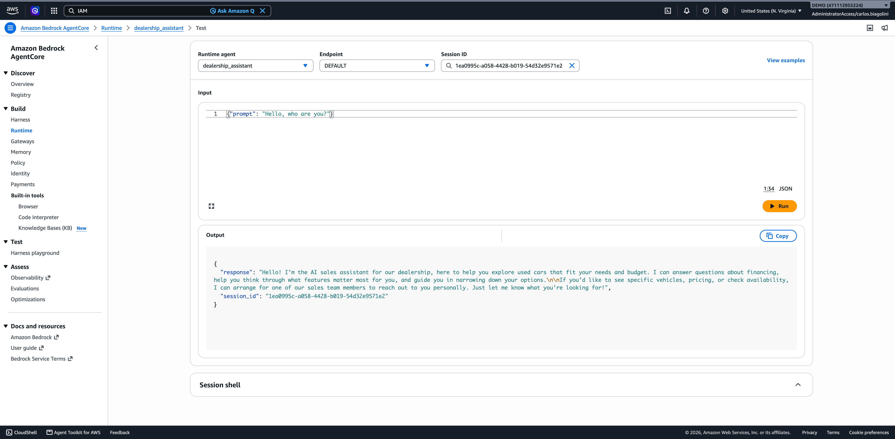

**Harness:** open `dealership_assistant_harness`, click **Test Harness**, and send `Hello, who are you?`

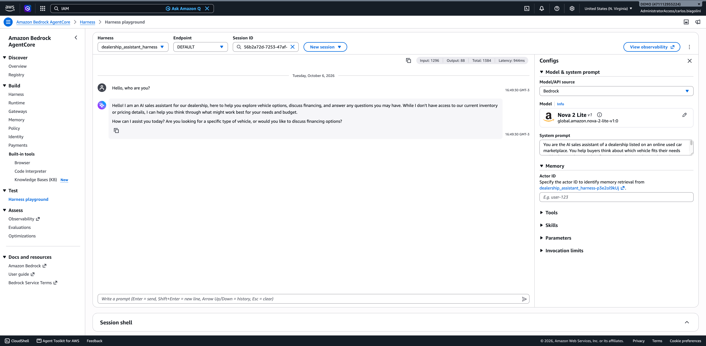

Both answer in the voice of the dealership assistant. The point here is only that the model answers on both paths.

## Step 7: What this shows

Same assistant, two ways to run it. The runtime keeps your code and your container, with full control. The Harness is configuration only, for agents that do not need custom code. You can keep customized agents on the runtime, and choose the Harness where simplicity matters more.

---

# Part 2: Connecting the Agent to MongoDB Atlas

**Goal:** add a new capability as a managed building block. The inventory stays where it already is, in Atlas, and the agent reads it through one small, reviewable tool, with no database password anywhere.

## Step 1: The data in Atlas

In Atlas, open the cluster, **Browse Collections**, database `car_marketplace`:

1. `stores`: the dealerships on the marketplace.
2. `cars`: one document per car, linked to its store by `store_id`, with `status` (`available`, `reserved`, `sold`).

Each store is a dealership, and each car is a listing.

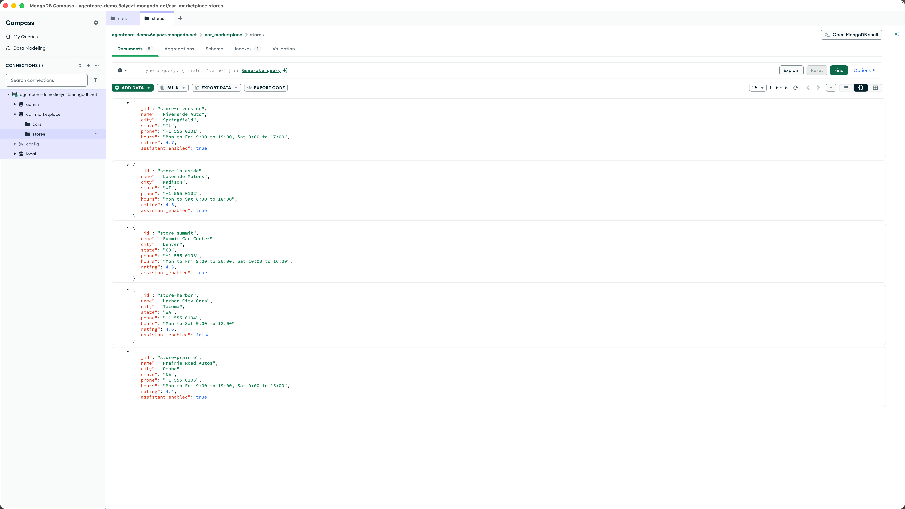

## Step 2: Create the IAM role for the tool: `atlas-demo-role`

**IAM > Roles > Create role**. On the first screen, for **Trusted entity type** choose **AWS service**, and under **Use case** choose **Lambda**. This gives the role the standard trust policy for `lambda.amazonaws.com`, so any Lambda function in the account can assume it; no need to name the function here.

Attach only **AWSLambdaBasicExecutionRole** (logs). Name it `atlas-demo-role` and copy its ARN.

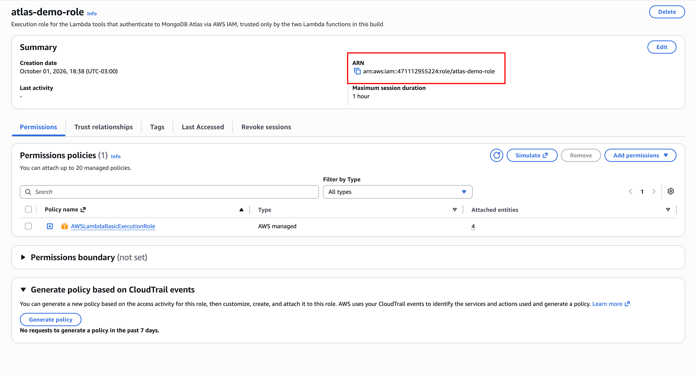

This role has no data permission in AWS. It only proves who the function is. The data permission is given on the Atlas side, next.

> **Behind the scenes:** the generated trust policy has `Principal: { "Service": "lambda.amazonaws.com" }`. This is a service principal, not an account principal, so the Lambda service assumes the role only for functions in this same account. It is not cross-account: a function in another AWS account cannot assume it. The one thing left open is inside the account (any Lambda here could assume the role, the classic confused deputy case); in production, tighten it with `aws:SourceArn` and `aws:SourceAccount` conditions scoped to the exact function ARN ([confused deputy prevention](https://docs.aws.amazon.com/codedeploy/latest/userguide/security_confused_deputy.html)). It is acceptable here because the role grants no data access in AWS: the real permission is read-only on one Atlas database.

## Step 3: Map the role to a database user in Atlas

**Database Access > Add New Database User**:

1. **Authentication Method:** AWS IAM. **AWS IAM Type:** IAM Role.
2. **AWS Role ARN:** the ARN of `atlas-demo-role`.
3. **Privileges:** Specific Privileges, **read** on database `car_marketplace`, collection blank.

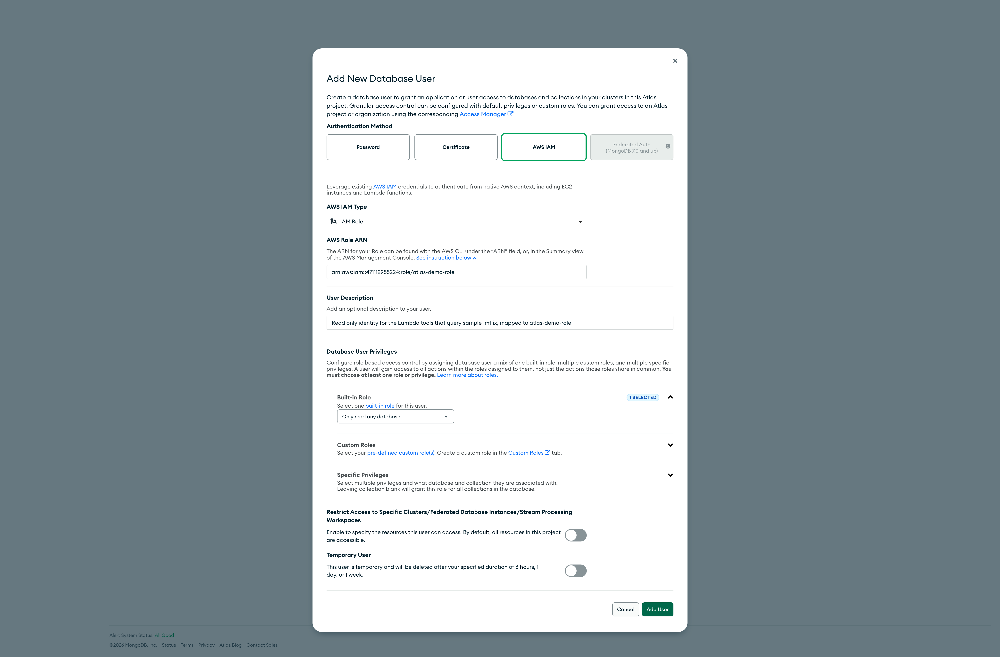

Read only, on one database. It cannot write, and it cannot see anything else in the cluster. No password to store or rotate.

**Network Access:** check the IP Access List has `0.0.0.0/0` with the comment `Allow all for demo only`. The function runs outside a VPC and the Free tier has no PrivateLink. In production: a dedicated cluster with PrivateLink.

## Step 4: Create the Lambda tool from the repository zip

**Lambda > Create function**, author from scratch:

1. **Name:** `dealership-search-cars`. **Runtime:** Python 3.14. **Architecture:** arm64.
2. **Execution role:** existing role `atlas-demo-role`.
3. **Code:** **Upload from > .zip file**, `lambda/dist/search_cars.zip` from the repository (already built).
4. **Configuration > General:** timeout **15 seconds**.
5. **Configuration > Environment variables:**

   ```
   MONGODB_URI = mongodb+srv://<your-cluster-host>/?authSource=%24external&authMechanism=MONGODB-AWS
   ```

   Only the host from your local `.env`, never the user and password.

6. **Test** the function. The response always has `count`, a list of `cars` with their stores, and a `next_token` (an opaque pagination cursor; `null` when there are no more results). The default page size is 5 (`limit`, up to 20). Run the examples below in order.

   **6.1. A simple test, no filters.** Send an empty event to get the first page of all available cars, cheapest first:

   ```json
   {}
   ```

   **6.2. The next page, with `next_token`.** The response from 6.1 includes a `next_token`. Pass it back to get the following page. This is keyset pagination: the token carries the position of the last car returned, so the next call continues right after it, without skipping or repeating:

   ```json
   {"next_token": "<next_token from the previous response>"}
   ```

   **6.3. A filtered query.** Pass filters to narrow the search by body type and price range:

   ```json
   {"body_type": "SUV", "min_price": 30000, "max_price": 35000}
   ```

   With a narrow filter the result set is small, so the response comes back with `"next_token": null`, which signals there are no more pages for this search. (When you do paginate a filtered search, repeat the same filters on every call and add the `next_token`; the token carries only the position, not the filters, the same way DynamoDB keeps the `Query` parameters alongside `ExclusiveStartKey`.)

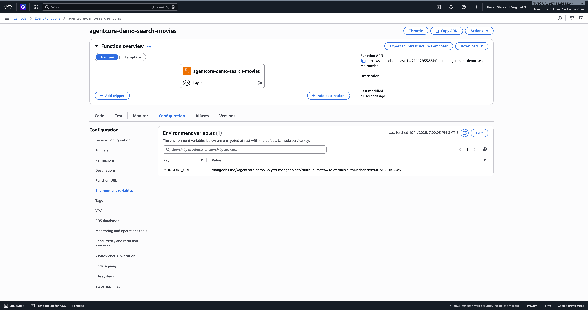

One fixed query, read only, about a hundred lines that a team can review. The model can choose the filters, never the query.

## Step 5: Expose the tool through AgentCore Gateway

5.1. **Gateway role** `DealershipGatewayRole`. Create it the guided way, like the Lambda role in Part 2, Step 2: **IAM > Roles > Create role**, **Trusted entity type** **AWS service**, then under **Use case** choose **Amazon Bedrock AgentCore**. This generates the trust policy for `bedrock-agentcore.amazonaws.com`, so you do not write it by hand.

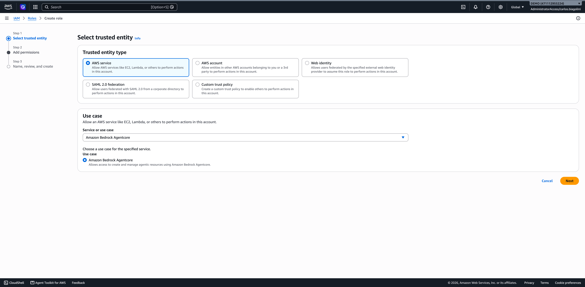

The use case sets up only the trust (who can assume the role). You still attach the permission it needs (what the role can do): invoke the Lambda target. On **Add permissions**, choose **Attach policies** and attach the AWS managed policy **`AWSLambdaRole`**.

`AWSLambdaRole` grants `lambda:InvokeFunction`, which is exactly what the gateway needs to call the function, and it works out of the box with no JSON to paste. For a short demo whose resources are deleted at the end, this is a fine, simple choice. In production, prefer least privilege instead: an inline policy that allows `lambda:InvokeFunction` only on your specific function ARN (and its `:*` version qualifier), rather than this managed policy, which allows it on any function in the account.

5.2. **Amazon Bedrock AgentCore > Gateways > Create Gateway**. The console walks through four steps:

**Step 1, Define gateway details:** set the **Name** to `DealershipTools` and, for permissions, use the role `DealershipGatewayRole` created above.

**Step 2, Configure Inbound Identity:** for **Inbound Auth type** choose **Use IAM permissions**. The gateway then authenticates and authorizes callers with SigV4, so only identities allowed to invoke it (such as the runtime's role in Step 6) can call it. The other options are broader: **No authorization** makes the gateway public, and **Authenticate only** checks the signature but delegates authorization to the target, which this demo does not want.

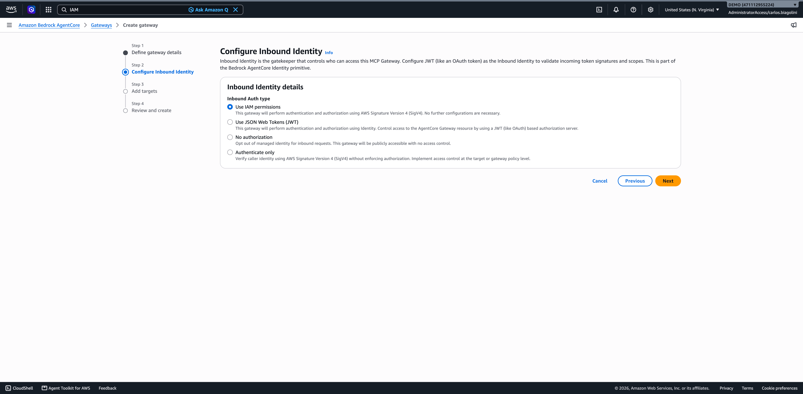

**Step 3, Add targets:** define the tool.

- **Target protocol:** **MCP target**.
- **Target name:** `search-cars`.
- **Passthrough:** **Do not use passthrough (default aggregated)**, so the gateway exposes the tool through its unified MCP interface.
- **Target type:** **Lambda ARN**, and select the `dealership-search-cars` function (the ARN resolves with `:$LATEST`).
- **Target schema:** **Define an inline schema**, and in the editor paste the content of `lambda/search_cars/tool_schema.json`, which describes the tool to the model (its name, when to use it, and each argument, including `next_token` for pagination):

   ```json
   [
     {
       "name": "search_cars",
       "description": "Search the dealership inventory for cars that are available now. Use it whenever the buyer asks what cars are in stock, for example by body type, price range, or make. Returns a page of cars sorted by price, with the store that sells each one. When the buyer asks for more results (for example 'show me more'), call search_cars again with the exact same filters and set next_token to the value returned in the previous response. When the response has next_token set to null, there are no more cars for that search.",
       "inputSchema": {
         "type": "object",
         "properties": {
           "body_type": { "type": "string", "description": "One of: SUV, Sedan, Pickup, Wagon" },
           "min_price": { "type": "number", "description": "Minimum price in US dollars" },
           "max_price": { "type": "number", "description": "Maximum price in US dollars" },
           "make": { "type": "string", "description": "Brand, for example Toyota or Honda" },
           "limit": { "type": "integer", "description": "Number of cars per page, 1 to 20, default 5" },
           "next_token": { "type": "string", "description": "Opaque pagination cursor. Omit it on the first page. To get the next page, pass the next_token returned by the previous call, keeping all other filters identical." }
         },
         "required": []
       }
     }
   ]
   ```

- **Outbound Auth configurations:** **IAM Role**, so the gateway signs its call to the Lambda with the Gateway execution role.

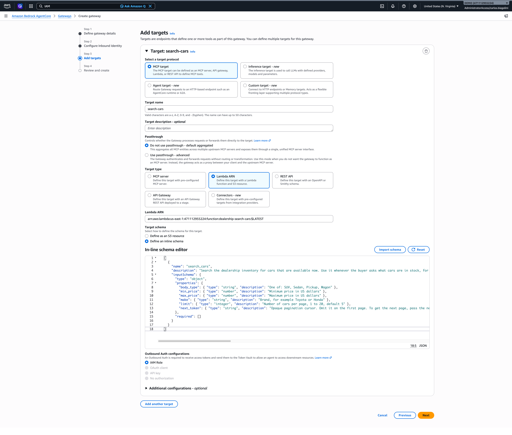

**Step 4, Review and create:** create the gateway, wait for **Ready**, and copy the **Gateway URL**.

5.3. On the Gateway page, enable **Log delivery** and **Tracing**, so Part 3 can show the tool calls.

5.4. Still on the gateway's details page, copy two values you need next, both shown here:

- **Gateway resource ARN** (for example `arn:aws:bedrock-agentcore:us-east-1:<account-id>:gateway/dealershiptools-xxxxxxxx`), used for the runtime's permission in Step 6.
- **Gateway resource URL** (for example `https://dealershiptools-xxxxxxxx.gateway.bedrock-agentcore.us-east-1.amazonaws.com/mcp`), used as `GATEWAY_URL` in Step 7.

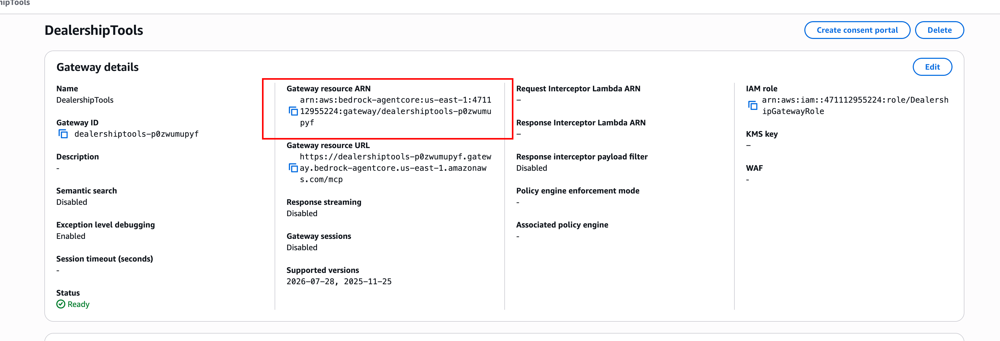

## Step 6: Allow the runtime to call the Gateway

The runtime's execution role needs permission to invoke the gateway. The quickest path reaches that role straight from the runtime, and it fits the edit you do next in Step 7.

1. Open **Amazon Bedrock AgentCore > Runtime**, open `dealership_assistant`, and click **Edit**.
2. Under **Permissions**, click **View role details in IAM**. This opens the default execution role the console created in Part 1, Step 4 (named `AmazonBedrockAgentCoreRuntimeDefaultServiceRole-xxxxx`).

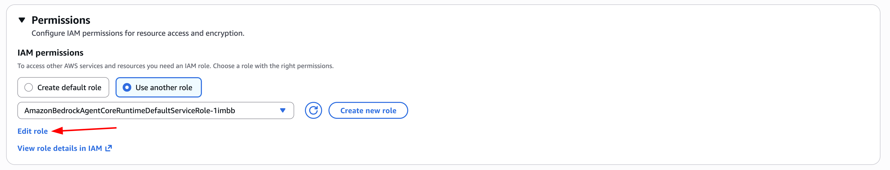

3. On the role, **Add permissions > Create inline policy**, switch to the JSON editor, and paste the policy below (name it something like `AllowInvokeDealershipGateway`). Replace the `Resource` with the **Gateway resource ARN** you copied in Step 5.4:

```json
{
  "Version": "2012-10-17",
  "Statement": [
    { "Effect": "Allow", "Action": "bedrock-agentcore:InvokeGateway",
      "Resource": "arn:aws:bedrock-agentcore:us-east-1:<account-id>:gateway/<gateway-id>" }
  ]
}
```

4. Save the policy. Then go back to the runtime's **Edit** page, still open, and continue with Step 7.

## Step 7: Give the runtime the Gateway URL

The image does not change: the same agent already knows how to load tools from a Gateway when `GATEWAY_URL` is set. You only add that variable. Back on the runtime's **Edit** page (still open from Step 6):

1. **Environment variables:** add `GATEWAY_URL` = the Gateway resource URL from Step 5.4. The model still comes from the agent's default (`BEDROCK_MODEL_ID` stays optional).
2. Save. A new version is created and, on V1, is ready in seconds.

Save the change, wait for **Ready**, and send a hello to warm it up before the inventory question.

That is the whole switch: one environment variable, no new image and no redeploy. The agent finds the tools in the Gateway by itself. Add a new tool to the Gateway later, and the agent sees it without a redeploy.

## Step 8: Ask about the inventory

In the runtime **Test**:

```json
{"prompt": "Which SUVs do you have between $30,000 and $35,000?"}
```

We ask about the same range used in the Lambda test (Step 4.3) on purpose: that filter returned only a couple of cars, so it is easy to confirm that the agent's answer matches the real data. The answer lists those same cars from `car_marketplace.cars`, with their exact prices, mileage, and the store, city, and state of each one. Those store-and-city details only exist in the database, so seeing them in the answer is the proof that the agent actually called the tool and did not invent the list.

Then ask for more of the same search, and the agent continues from where it stopped:

```json
{"prompt": "Show me more models like these."}
```

The agent reuses the previous filters and the `next_token` from the last tool result, so this returns the next page without repeating cars. Simple questions still work too:

```json
{"prompt": "Hello! What can you help me with?"}
```

## Step 9: The Harness, in one sentence

The same Gateway can be attached to the Harness with one click, to run this assistant without a container.

---

# Part 3: Reviewing the Console

**Goal:** for each agent, see what it did, how long it took, and what it cost, instead of a single line on the bill.

Traces take a few minutes to arrive, so run a few invocations first and give them time to show up.

## Step 1: The runtime's own metrics

Open the runtime `dealership_assistant` (now with the Gateway URL set) and scroll to **Observability**: sessions, invocations, error rate, vCPU and memory consumption. This is what you pay for on the runtime: actual use, not reserved capacity.

## Step 2: The agent view in GenAI Observability

Open **CloudWatch > GenAI Observability > Bedrock AgentCore**. Per agent: sessions, traces, tokens, cost, and errors. This is the answer to "what does each agent cost?".


## Step 3: One conversation, end to end

Open the trace of the inventory question (**Application Signals > Transaction search**, or from the agent view). The sequence shows the model call, the `search-cars___search_cars` tool call with its arguments, the second model call, and the time of each step. This is the audit trail: which tool was called, with which arguments, and when.


## Step 4: The tool's logs

Open the Lambda `dealership-search-cars` > **Monitor > View CloudWatch logs**. Each call logs the filters the model chose and how many cars matched (`search_cars query=... matched=...`).

## Step 5: Optional

**CloudWatch > GenAI Observability > Model invocations**: tokens and latency for every model call in the account.

---

## Frequently Asked Questions

| Question | Answer |
|---|---|
| Do I have to rewrite my agents? | No. Same LangGraph code, same container, built for ARM. Part 1 used an unchanged LangGraph agent. |
| Why Harness and Runtime? | Runtime for control and existing code; Harness for speed on simple agents. A Harness can be exported to code later. |
| How does the Lambda log in to Atlas? | With its execution role, through AWS IAM authentication. Atlas maps the role to a read only database user; no secret is stored. |
| Why a Lambda and not the MongoDB MCP Server? | The MCP Server lets the model build its own queries; one fixed query is easier to review and approve for a buyer facing agent. The MCP Server fits an internal analyst agent. |
| What if the Gateway is down? | The agent logs the error and still answers, without tools. The hello in Part 2, Step 8 needs no tool. |
| Who can call the Gateway? | Only roles with `InvokeGateway` on it, such as the runtime's role. |
| How does "show me more" work? | `search_cars` returns an opaque `next_token` with the sort key of the last car on the page (keyset pagination). The agent passes it back on the next call, keeping the same filters, and the query continues strictly after that car. This is the same idea as DynamoDB's `LastEvaluatedKey` / `ExclusiveStartKey`, or the `NextToken` many AWS APIs expose. It avoids `skip`/offset, so no car is skipped or repeated if the inventory changes between calls. The Lambda stays stateless; the token travels in the conversation. |
| What does it cost? | Consumption per capability plus model tokens, visible per agent in Part 3. |

## Cleanup

1. Runtime `dealership_assistant`, and its execution role.
2. Harness `dealership_assistant_harness` and its execution role.
3. Gateway `DealershipTools` and its target, and the role `DealershipGatewayRole`.
4. Lambda `dealership-search-cars` and the role `atlas-demo-role`.
5. In Atlas, the AWS IAM database user mapped to `atlas-demo-role`, and the `0.0.0.0/0` entry.
6. ECR repository `agentcore/dealership-assistant-agent`, and the GitHub OIDC role if you created one.

## Validation Checklist

1. The image in ECR with `latest`, and the last pipeline run green?
2. The runtime ready, the Harness ready, and each one answered a hello?
3. Lambda test event returns cars?
4. The inventory question answered through the runtime with `GATEWAY_URL` set?
5. Traces visible in GenAI Observability?
